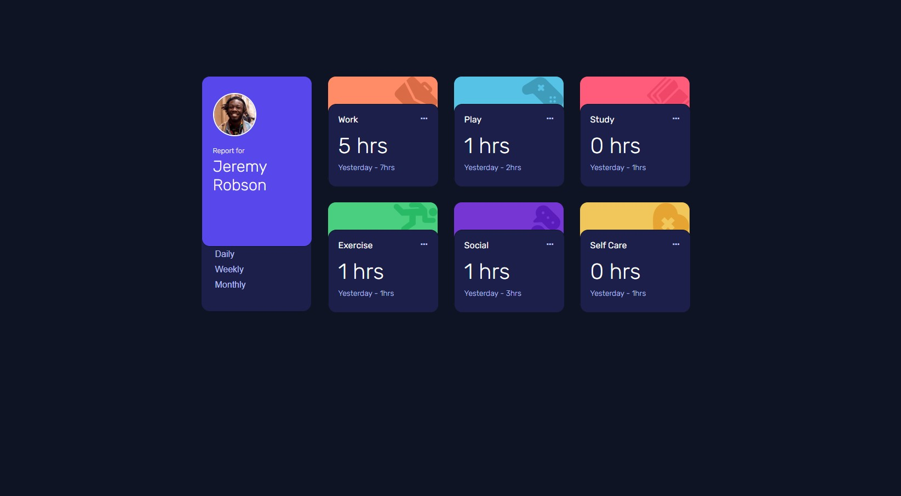
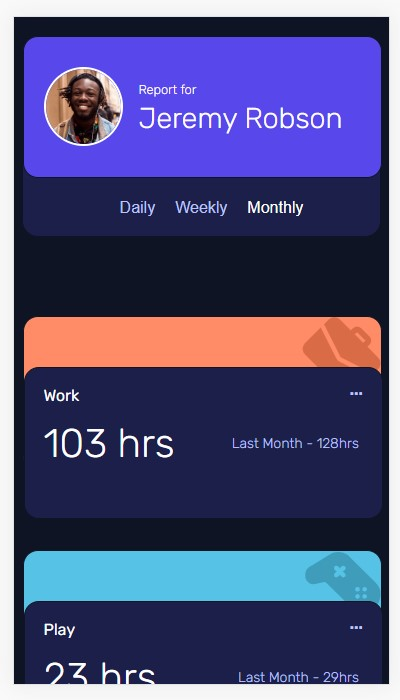

## Overview

### The challenge

Users should be able to:

- View the optimal layout for the site depending on their device's screen size
- See hover states for all interactive elements on the page
- Switch between viewing Daily, Weekly, and Monthly stats

### Screenshot

## My process

### Built with

- CSS Grid
- [React](https://reactjs.org/) - JS library

### What I learned
hideously overcomplicated the functionality and had to review a couple of other solutions to see where I went wrong, especially around jJS array map.

https://7whvy4-3000.preview.csb.app/
